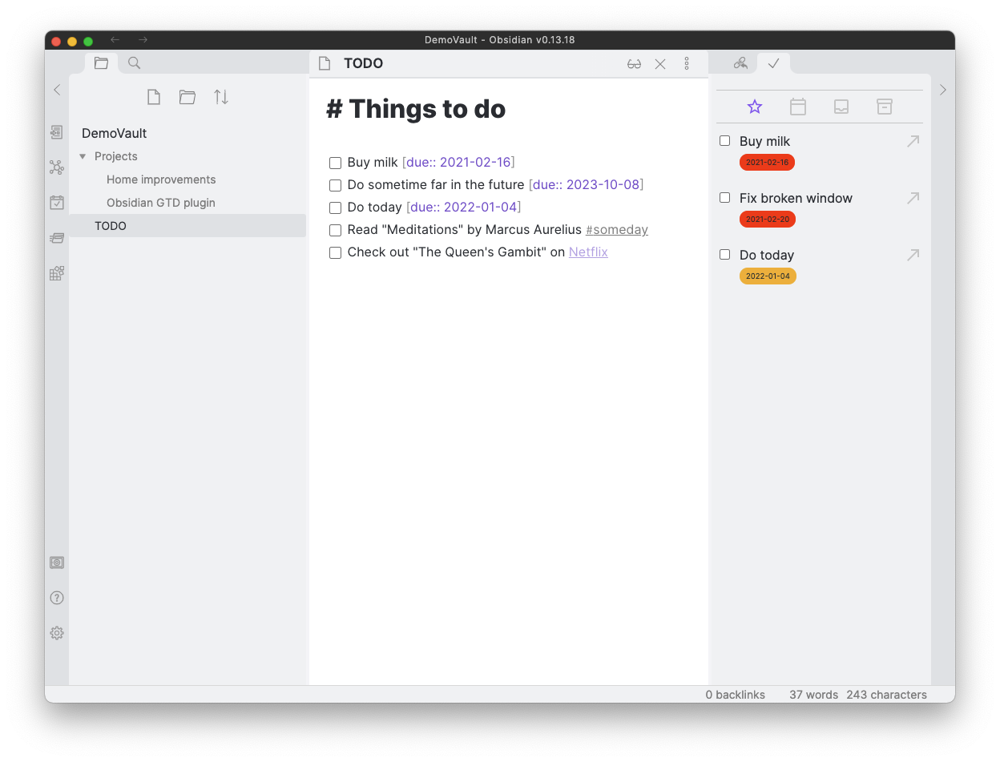
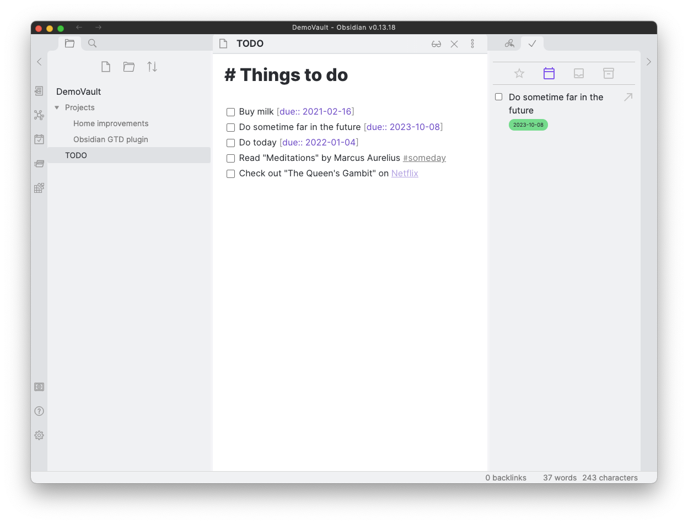
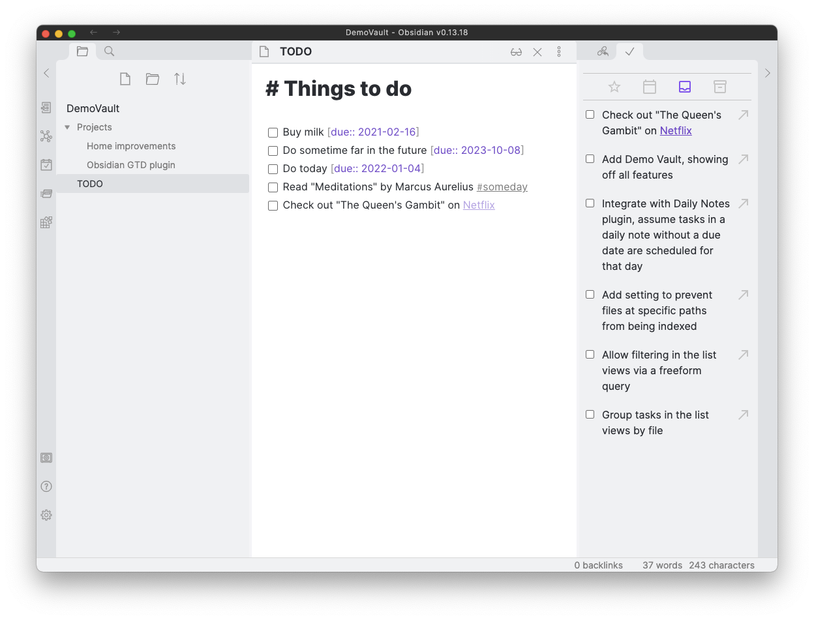

## Obsidian TODO Plugin

Text-based GTD in Obsidian.

### Features
- Aggregates all outstanding TODOs in your vault and lists them in a single view
- Split out TODOs by type ("Today", "Scheduled", "Inbox" and "Someday/Maybe")
- Schedule a TODO for a specific date by adding a tag
- Mark a TODO as Someday/Maybe by adding a tag #someday
- Complete TODOs from the list view
- Quickly jump to the file in which a TODO is found from the list view

### Settings
**Date tag format**: Customise the format you use to add due dates to your tasks. Defaults to `#%date%`.

**Date format**: Customise the date format. Uses luxon under the hood. See [their documentation](https://moment.github.io/luxon/#/formatting?id=table-of-tokens) for supported tokens. Defaults to `yyyy-MM-dd`.

**Open files in a new leaf**: When enabled, files opened from within the plugin will open in a new leaf rather than replacing the currently opened file.

### Screenshots

### Roadmap
- [ ] Scroll to correct line in file when jumping from list view
- [ ] (Re)schedule TODOs from the list view
- [ ] Persist cache, on reopening only reindex files changed since Obsidian was closed
- [ ] Filter items list view by tags / freeform search
- [ ] Improve UI and themeability
- [ ] Integrate with daily notes plugin to ensure unscheduled TODOs in a daily note are listed in "Today"
